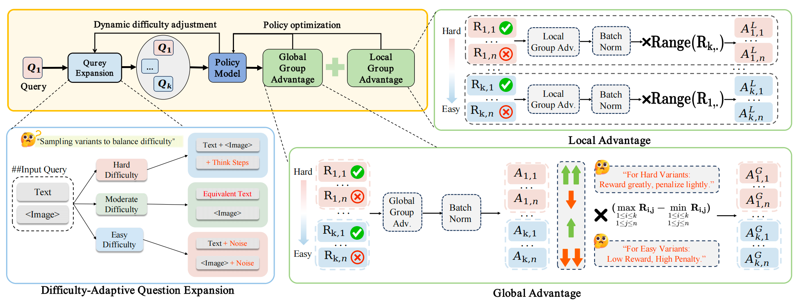

# DIVA-GRPO: Enhancing Multimodal Reasoning through Difficulty-Adaptive Variant Advantage

[](https://openreview.net/forum?id=qKXYEg00eH&referrer=%5BAuthor%20Console%5D(%2Fgroup%3Fid%3DICLR.)cc%2F2026%2FConference%2FAuthors%23your-submissions) 
[](https://opensource.org/licenses/MIT)
[](https://www.python.org/downloads/release/python-3100/)

This is the official repository for the ICLR 2026 paper **"DIVA-GRPO: Enhancing Multimodal Reasoning through Difficulty-Adaptive Variant Advantage"**.

DIVA-GRPO is a reinforcement learning framework based on Group Relative Policy Optimization (GRPO) specifically designed for Multimodal Large Language Models (MLLMs). It dynamically assesses problem difficulty, generates tailored variants, and computes local/global advantages with reward-range-based rescaling to mitigate reward sparsity and advantage vanishing.



## 🚀 Key Features
- **Dynamic Difficulty Assessment**: Adaptively estimates problem difficulty based on model capabilities.
- **Difficulty-Adaptive Variant Generation**: Generates text, image, and hint variants to maintain an optimal difficulty distribution.
- **RRB-Rescaling**: Reward-Range-Based Advantage Rescaling to stabilize training signals.
- **High Efficiency**: Achieves State-of-the-Art performance on 7B models with significant end-to-end training speedup.

---

## 🛠️ Installation

1. Create a conda environment and activate it:
```bash
conda create -n diva python=3.10
conda activate diva

```

2. Install dependencies (Requires CUDA and PyTorch):

```bash
pip install -r requirements.txt
# Install the framework in editable mode
pip install -e .

```

---

## 📊 Dataset Preparation & Augmentation

Our training relies on dynamically augmented datasets with difficulty variants and reasoning "think steps". We use the [R1-ShareVL-52K](https://huggingface.co/datasets/HuanjinYao/R1-ShareVL-52K) dataset as our base.

### 1. Download Base Dataset

Download the base dataset from Hugging Face and save it locally as a Parquet file (e.g., `data/r1_sharevl_52k.parquet`).

### 2. Generate Variants and Think Steps

We provide a high-performance, multiprocessing script to call Azure OpenAI (or other LLMs) to generate the variants and reasoning steps.

First, export your API credentials:

```bash
export AZURE_OPENAI_KEY="your_api_key_here"
export AZURE_OPENAI_ENDPOINT="your_endpoint_here"

```

Next, run the augmentation script. You can adjust the `--workers` argument based on your API rate limits:

```bash
python verl/difficulty_variation/augment_dataset.py \
    --input data/r1_sharevl_52k.parquet \
    --output data/r1_sharevl_52k_augmented.parquet \
    --workers 8

```

*Note: This script (`augment_dataset.py`) utilizes a listener-worker architecture with IPC queues to ensure thread-safe, incremental saving of generated data to a single Parquet file.*

---

## 🏃‍♂️ Training

We provide example scripts to launch the training process using Ray and vLLM. To train Qwen2.5-VL-7B with the DIVA-GRPO algorithm, please update the paths in the script and run:

```bash
bash examples/main_exp/ZSCORENORM_WAN_RRBLOCAL_RRBGLOBAL_5000_k=0.1.sh

```

### Key Hyperparameters

* `k=0.1`: The sensitivity parameter for difficulty-weighted scaling.
* `Z-Score Norm`: Applies batch-level z-score normalization separately to local and global advantages.
* `RRB-Rescaling`: Reward-Range-Based Rescaling prevents inflated advantages from minor reward differences.

---

## 🤝 Acknowledgments

This project is built upon the excellent open-source [verl](https://github.com/volcengine/verl) framework. We express our gratitude to the authors for their foundational work.